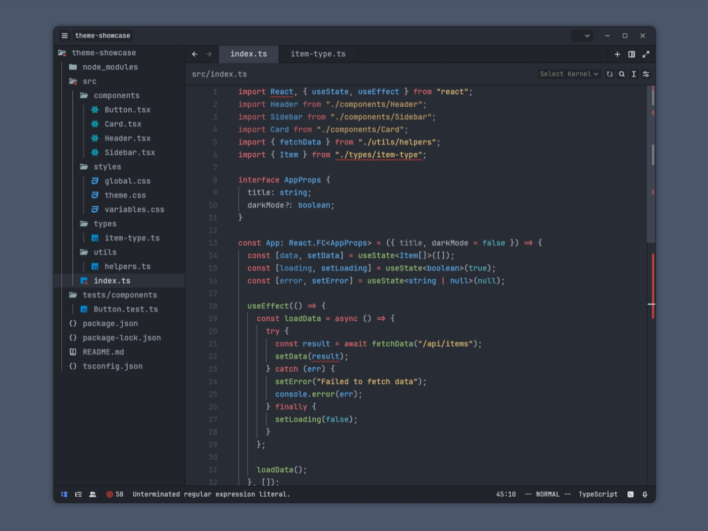

# One Monokai Theme for Zed

This is a conversion of the popular One Monokai theme from VSCode for the Zed editor. A cross between Monokai and One Dark theme.



## Installation

1. Download the `one_monokai.json` file from this repository.
2. Move the downloaded JSON file to the Zed themes directory:
   ```sh
   mv one_monokai.json ~/.config/zed/themes/
   ```
3. Open Zed and go to the settings to select the One Monokai theme.

Enjoy your new theme!
